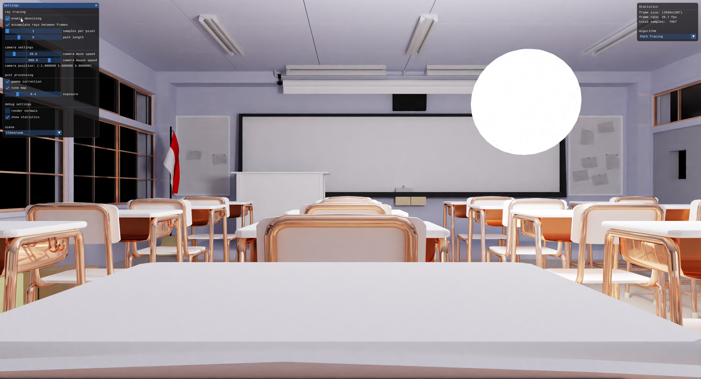
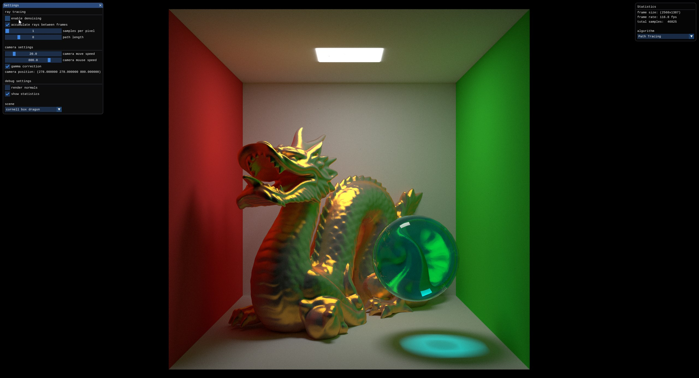

# Lift





###### Build Instructions

> Install CUDA 10.2, Optix 7.1 and vulkan SDK 1.2 \
> While VK_KHR_ray_tracing is in beta the beta drivers are needed https://developer.nvidia.com/vulkan-driver
*  Install Directories should be specified on cmake or you can set them as system variables

> currently supported on visual studio and clion
 
```bash
git clone --recurse-submodules https://github.com/GoncaloFDS/Lift
cd Lift
.\vcpkg_windows.bat
```

> Visual Studio
```bash
.\build_windows.bat
```

> Clion (for now MSVC is required)
>* Add these to your Cmake Options
>* Just Open this directory and select x64 build target 
```
 -D VCPKG_TARGET_TRIPLET=x64-windows-static -D CMAKE_TOOLCHAIN_FILE=build/vcpkg.windows/scripts/buildsystems/vcpkg.cmake
```

## Includes code from

* [GPSnoopy/RayTracingInVulkan](https://github.com/GPSnoopy/RayTracingInVulkan)

## References

* [Introduction to Real-Time Ray Tracing with Vulkan](https://devblogs.nvidia.com/vulkan-raytracing/)
* [Siggraph 2019 OptiX 7 Course Tutorial Code](https://gitlab.com/ingowald/optix7course)
* [vk_denoise](https://github.com/nvpro-samples/vk_denoise)
